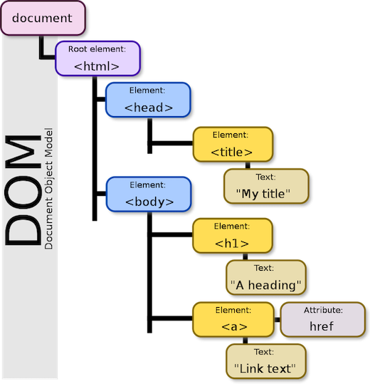

# Javascript

### O objetivo desse módulo é apresentar às alunas conceitos básicos de javascript, tais como switch case, funções, arrays e manipulação do DOM.


***

  * [Chamando o JS dentro do HTML](#chamando-o-js-dentro-do-html)
  * [Arrays](#arrays)
  * [Funções](#funções)
  * [Operador ternário](#operador-ternário)
  * [Switch case](#switch-case)
  * [Manipulação do DOM](#manipulação-do-dom)
    - [DOM](#dom)
    - [getElementById()](#getelementbyid)
    - [querySelector()](#queryselector)
    - [addEventListener()](#addeventlistener)
      - [DOMContentLoaded](#domcontentloaded)
      - [click](#click)
      - [mouseover](#mouseover)
      - [change](#change)
    - [innerHTML](#innerHTML)
    - [innerText](#innerText)


### Chamando o JS dentro do HTML

```html
<!DOCTYPE html>
<html>
  <head>
    <link rel="stylesheet" href="css/style.css">
  </head>
  <body>
    <h1>Título</h1>
    <p>Parágrafo</p>
    <script src="js/script.js"></script>
  </body>
</html>
```

#### Arrays

Array é um tipo de variável que engloba uma lista variáveis. Normalmente é utilizada para agrupar variáveis que tem relação entre si.

Ao invés de declarar três variáveis diferentes, você pode declarar um array de variáveis:

```js
let sanduicheQueijo = "Queijo";
let sanduicheRosbife = "Rosbife";
let sanduicheVegetariano = "Vegetariano";
```

```js
let sanduiches = ["Queijo", "Rosbife", "Vegetariano"];
```

Você pode acessar cada uma através da sua posição no array:

```js
sanduiches[0]; // retorna a primeira posição do array "Queijo"
```

```js
sanduiches.length; // retorna 3, a quantidade de variáveis dentro do array
```

```js
sanduiches.forEach(function(item, index) {
  console.log(item, index);
  // Queijo 0
  // Rosbife 1
  // Vegetariano 2
});
```

```
Importante:
Em javascript as posições sempre começam em 0.
```

#### Funções

A função é útil para agrupar um pedaço de código, que pode ser reutilizado em outras partes do seu código.

A função é declarada com a sintaxe abaixo, e o código dentro dela só é executado quando a função é chamada.

```js
function nomeDaFuncao (parametros) {
  // código que vai ser executado quando a função for chamada
}

nomeDaFuncao(parametros); // chamada da função
```

```js
function toCelsius(fahrenheit) {
  return (5/9) * (fahrenheit - 32);
}
document.getElementById("result").innerHTML = toCelsius(77); // retorna 25
```

#### Operador ternário

O operador ternário funciona como um if/else, só que tem uma sintaxe mais enxuta

```js
(condição) ? resultado verdadeiro : resultado falso

let idade = 26;
let bebida = (idade >= 21) ? "Cerveja" : "Suco";
console.log(bebida); // Cerveja
```


#### Switch case

O `switch case` funciona com o mesmo princípio do `if/else`, porém com uma sintaxe diferente.
Ele é útil quando você tem que fazer várias comparações. O seu código vai ficar mais fácil de ler com ele.

```js
switch(expressão) {
  case x:
    // se a condição for verdadeira, o código aqui dentro será executado
    break;
  case y:
    // se a condição anterior não for verdadeira, o código aqui dentro será executado
    break;
  default:
    // se a condição anterior não for verdadeira, o código aqui dentro será executado
}
```

```js
let fruta = 'Banana';

switch(fruta) {
  case 'Pera':
    alert('Não é a fruta que queremos');
    break;
  case 'Banana':
    alert('É a fruta que queremos!');
    break;
  default:
    alert('Não encontramos o que queriamos');
}
```

* [Exercicios](https://github.com/reprograma/On3-javascript/blob/master/exercicios/exercicio-1.md)

***

### Manipulação do DOM

#### DOM

`DOM = Document Object Model`

O DOM é uma interface que representa como os documentos HTML e XML são lidos pelo seu browser. Após o browser ler seu documento HTML, ele cria um objeto que faz uma representação estruturada do seu documento e define meios de como essa estrutura pode ser acessada. Cada node (nó) representa uma parte desse interface.
Nós podemos acessar e manipular o DOM com JavaScript.

```
É um mapa do estrutura do HTML que você está rodando no navegador.

É a árvore genealógica do HTML.
```


***




Conseguimos interagir com o DOM através dos métodos e eventos descritos abaixo.


#### getElementById()

Esse método retorna o elemento que estiver contendo o nome do ID passado. Como os IDs devem ser únicos, é um método muito útil para pegar apenas o elemento desejado.

```html
<div>
  <input type="text" id="textInput" class="text-input"  />
</div>
```

```js
let getInputId = document.getElementById('textInput');
```

#### querySelector()

Esse método retorna qualquer elemento do DOM, como classes, tags e ID's. Você precisa deixar explicito se está chamando uma classe, um ID ou uma tag.

```html
<div>
  <input type="text" id="textInput" class="text-input" />
</div>
```

```js
let getInputId = document.querySelector('#textInput');
let getInputClass = document.querySelector('.text-input');
let getInputTag = document.querySelector('input');
```

```
Importante:
Vamos utilizar sempre os seletores de ID. No HTML as classes vão ser utilizadas para estilizar o CSS, e o ID vai ser utilizado para manipular o DOM pelo Javascript.
```

#### addEventListener()
Os elementos DOM além de possuirem métodos também possuem eventos. São eles que fazem a interatividades dos elementos no documento.


##### DOMContentLoaded

O código HTML é lido de cima para baixo. No header do HTML nós chamamos nosso arquivo de .js, e ele é lido e executado imediatamente, antes mesmo do HTML ser carregado.
Para evitar isso, nós vamos sempre colocar nossos códigos js dentro da função abaixo:

```js
window.addEventListener('DOMContentLoaded', function() {
  // aqui vai todo o código a ser executado na página
});
```

Ela vai fazer com que o browser leia nosso arquivo .js mas espero o DOM terminar de carregar para executar os códigos que estão dentro do nosso arquivo.


##### click

O `click` captura a ação de clique em um elemento.

```html
<div>
  <button id="button">Salvar</button>
</div>
```

```js
let getButtonId = document.querySelector('#button');

getButtonId.addEventListener('click', function() {
    // quando o botão for clicado esse código será executado
  });
```

##### mouseover

O `mouseover` dispara um evento quando passamos o mouse em cima do elemento.

```html
<div>
  <button id="button" />
</div>
```

```js
let getButtonId = document.querySelector('#button');

getButtonId.addEventListener('mouseover', function() {
    // quando o mouse passar por cima do botão esse código será executado
  });
```

##### change

O `change` normalmente é utilizado para elementos HTML do tipo dropdown (tag select). Ele é disparado quando modificamos uma opção selecionada em um select. A cada `change` é possível pegar o valor (`value`) de cada opção selecionada.

```html
<select id="select">
  <option value="option1">Opção 1</option>
  <option value="option2">Opção 2</option>
</select>
```

```js
let getSelectId = document.querySelector('#select');

getSelectId.addEventListener('change', function() {
    // quando o element for modificado esse código será executado
  });
```

#### innerHTML

```html
  <div id="displayText"></div>
```

```js
let displayText = document.querySelector('#displayText');
displayText.innerHTML = "<p>Texto que eu inseri no HTML</p>."

```

#### innerText

```html
  <div id="displayText"></div>
```

```js
let displayText = document.querySelector('#displayText');
displayText.innerText = "Texto que eu inseri no HTML."

```


* [Exercicios](https://github.com/reprograma/On3-javascript/blob/master/exercicios/exercicio-2.md)
