# Passo a passo para subir seu projeto de casa no github

## Passo 1 - git clone

Primeiramente vocês devem acessar o link do repositório, na página inicial clicar no botão `clone or download`

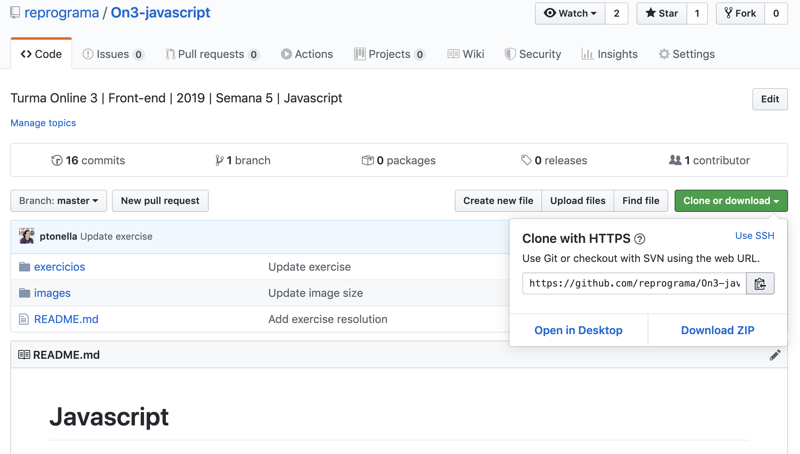

Abra seu terminal (bash), para saber em que pasta você está, pode usar o comando `ls`, assim ele listará tudo que há na pasta em que se encontra, caso precise entrar uma das pastas, use o comando `cd nome-da-pasta` ou para sair de dentro de uma pasta use o comando `cd ..` . Usando estes três comandos navegue até a pasta onde você pretende fazer o clone do repositório.

De um git clone e cole o link que copiou do repositório

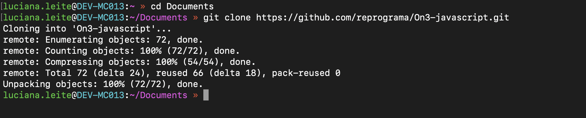

Para verificar se o seu clone funcionou, use o comando `ls` e confira se a pasta com o nome do repositório se encontra. No nosso exemplo é a pasta `/On3-javascript`, entre nela usando o comando `cd nome-da-pasta`

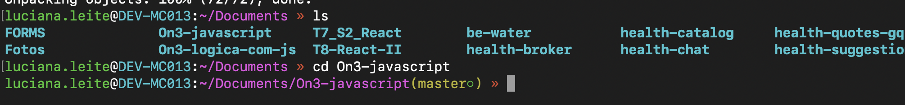

Pronto, acessamos nosso repositório!

## Passo 2 - git checkout

Agora precisamos criar a branch da qual utilizaremos para subir nosso exercício da semana. De o `git checkout -b nome-da-sua-branch`. Por padrão e para facilitar na hora de dar a presença de vocês, vamos adotar o próprio nome da aluna como branch, ok?

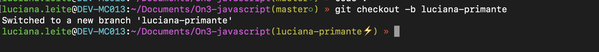

Você pode verificar que agora sua nova branch deverá aparecer no terminal. Caso queira ter certeza que o comando deu certo de um `git branch`, ele deverá listar todas as branchs do repositório, inclusive a sua! Para sair da tela que abriu, aperte a tecla `q` (do inglês *quit*)

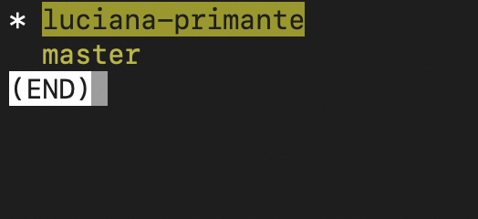

## Passo 3 - git add

Chegou a hora de criar a nossa pasta para colocar o exercício da semana dentro! A ideia é usar a pasta `/entrega-exercicio-casa` como base para todas as pastas de alunas. Portanto ao dar o comando `ls` você deverá visualizar a pasta `/entrega-exercicio-casa`, e para entrar na pasta utilize o comando `cd entrega-exercicio-casa`

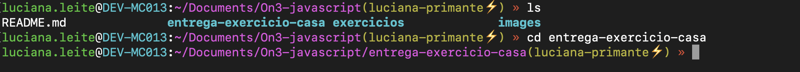

Para criar a pasta com seu nome, digite o comando `mkdir nome-da-pasta`. Em nosso caso o *nome-da-pasta* deverá ser seu nome. Feito isso vamos conferir se a pasta realmente foi criada digitando o comando `ls`

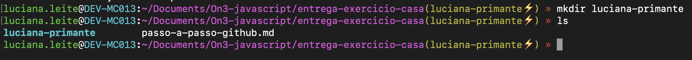

Se sua pasta apareceu é porque está tudo correndo como o esperado e finalmente podemos colocar dentro dela nossos arquivos com a solução do exercício! Abra seu editor, crie ou copie e cole a resolução do exercício dentro da pasta criada. Feito isso vamos dar um `git status`, ele deverá te retornar a sua nova pasta criada

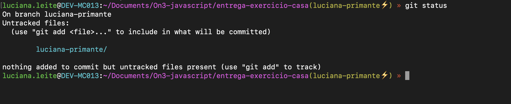

Ao dar o comando de `git add luciana-primante` e depois um novo `git status` veja que o resultado dele muda, pois agora sua nova pasta e arquivos estão em `stage`, ou seja, na área de pré-commit

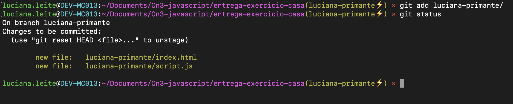

### Bonus

Use o seu **vscode** para ter uma noção visual do que o git te diz. Veja que ele mostra todos os arquivos que foram criados. Fica a dica para quando você achar que o terminal não está te ajudando muito rs

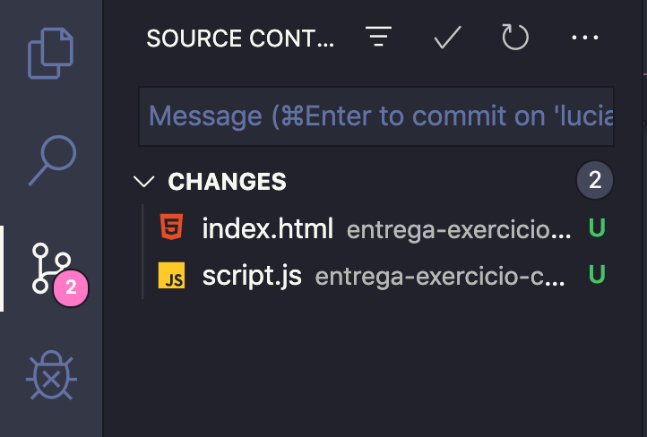

***

## Passo 4 - git commit

Vamos adicionar nossos arquivos de `stage` para `commit` usando o comando `git commit -m "mensagem do commit"`, percebam que ao dar um novo `git status` ele novamente mostrará que não há mais nada novo para commitar

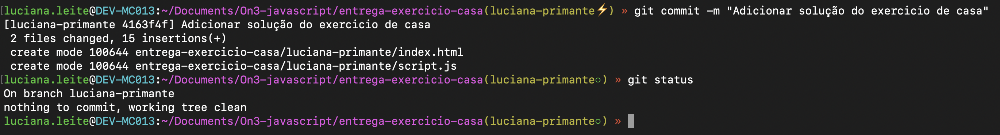

Vamos agora entender o que rolou ali após o comando de commit:

  - [luciana-primante 4163f4f] Adicionar solução do exercicio de casa - Ele nos informa a branch, o número de identificação do commit e a mensagem que digitamos
  - 2 files changed, 15 insertions(+) - Ele nos indica quantas modificações ocorreram
  - create mode 100644 entrega-exercicio-casa/luciana-primante/index.html e create mode 100644 entrega-exercicio-casa/luciana-primante/script.js - Ele indica o tipo de modificação e onde ocorreram, no caso criamos dois arquivos nas pastas indicadas

### Bonus

## Passo 5 - git push

## Passo 6 - abrir o Pull Request
